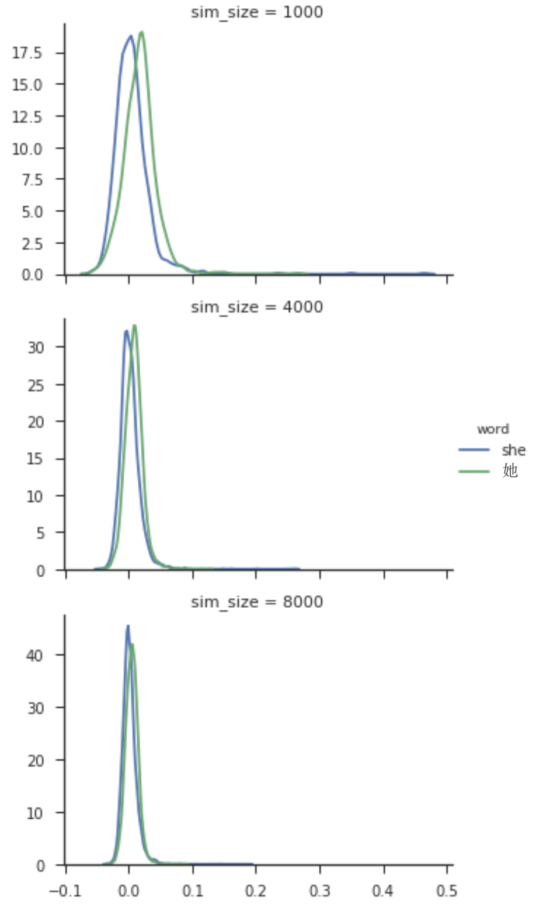

# wordvec-aligned-en-zh
Aligned English and Chinese bilingual word vectors. 

```python
import os
from utils import read_wordvec

if not os.path.exists('wiki.en.align.vec'):
    os.system('wget https://s3.amazonaws.com/aligned-en-zh-wordvec/wiki.en.align.vec')
if not os.path.exists('wiki.zh.align.vec'):
    os.system('wget https://s3.amazonaws.com/aligned-en-zh-wordvec/wiki.zh.align.vec')
    
en_words, en_vectors, en_word2id = read_wordvec('wiki.en.align.vec')
zh_words, zh_vectors, zh_word2id = read_wordvec('wiki.zh.align.vec')

# Find the closest words to 'cat' in Chinese 
scores = zh_vectors.dot(en_vectors[en_word2id['cat']])
for idx in np.argsort(-scores)[0:5]:
    print('%s: %.4f' % (zh_words[idx], scores[idx]))

# 猫: 0.2498
# 貓: 0.2375
# 老鼠: 0.2340
# 喵: 0.2331
# 青蛙: 0.2316
```

## Alignment
The input word vectors are top 40k words from [fastText Wiki embeddings](https://github.com/facebookresearch/fastText/blob/master/pretrained-vectors.md). The alignment is achieved using the unsupervised method in ["A robust self-learning method for fully unsupervised cross-lingual mappings of word embeddings"](https://arxiv.org/pdf/1805.06297.pdf). 

Notes:
I tried the [official impletention](https://github.com/artetxem/vecmap) with default parameters multiple times, but the alignment doesn't converge (translation accuracy < 0.1%). I had to set this [unsupervised_vocab](https://github.com/artetxem/vecmap/blob/master/map_embeddings.py#L120) parameter to 8000 instead. Following Figure 1 in the paper, I checked the unsupervised word similarity distributions between 'she' and '她' ('she' in Chinese) for different values of unsupervised_vocab. It seems the larger this value, the better the initilization. So maybe 4000 is not enough to get the algorithm started for Chinese, which is very different from English. For language closer to English like DE, the default value works fine.

<p align="center"></p>

## Results
45% top@1 word translation accuracy on English to Chinese bilingual dictionary from [MUSE](https://github.com/facebookresearch/MUSE#ground-truth-bilingual-dictionaries).
